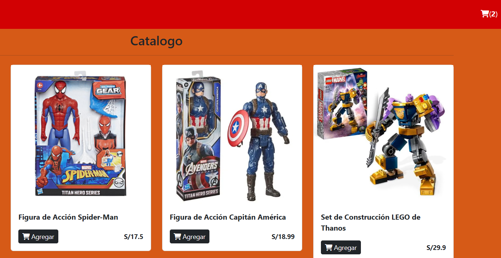
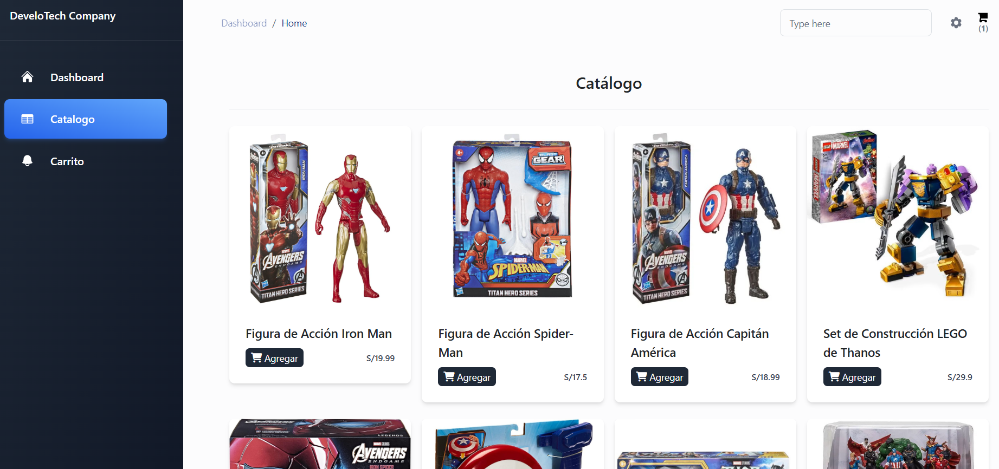
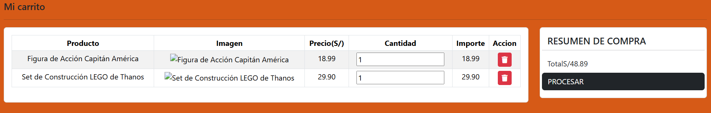
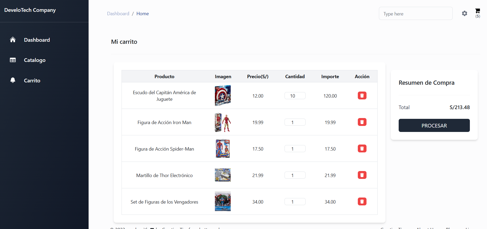
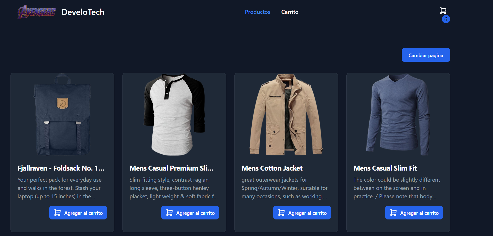

# Angular Advengers

[](https://jose-daniel-g.github.io/AngularAdvengers/)

[🚀 See demo de Advengers](https://jose-daniel-g.github.io/AngularAdvengers/)
[🔥  See Project tutorial](https://jose-daniel-g.github.io/frontend-store/inicio)
---

## Descripción del Proyecto

Este es un proyecto de carrito de compras desarrollado con Angular. Se centra en la gestión de productos y la experiencia de usuario, utilizando las herramientas y funcionalidades que ofrece el framework.

---

## Screenshots
|                 FIRST VERSION                     |              SECOND VERSION                          |
|---------------------------------------------------|------------------------------------------------------|
||
|        |          |

|    NICE VESION TUTORIAL     |
|-----------------------------|
||


## Cómo Empezar
- versión 18.2.11.

### Servidor de Desarrollo

Ejecuta `ng serve` para iniciar el servidor de desarrollo. Navega a `http://localhost:4200/`. La aplicación se recargará automáticamente si cambias alguno de los archivos fuente.

### Comandos Útiles

* **Generar componentes:** `ng generate component component-name`
* **Compilar el proyecto:** `ng build`. Los artefactos de compilación se almacenarán en el directorio `dist/`.

### Testing

* **Ejecutar pruebas unitarias:** `ng test`
* **Ejecutar pruebas end-to-end:** `ng e2e`

---
###### Deploy Angular en GitHub Pages

1. **Revisar el `angular.json`**  
   - Ir a:  
     ```json
     "projects": { "frontend-store": {
     ```
   - Ese es el **nombre de tu proyecto**.  
   - En la sección `build > options`, agrega (debajo de `outputPath`):  
     ```json
     "baseHref": "/frontend-store/"
     ```
---

2. **Instalar la herramienta de despliegue (si no está instalada)**  
   ```bash
   npm install -g @angular/cli
   ng add angular-cli-ghpages
   ng build --configuration production --base-href "/frontend-store/"
   ng deploy --base-href=https://jose-daniel-g.github.io/Angular_adminlte/
   ```
   - De lo contrario si ya esta en angular.json configurado
   ```bash
   ng build --configuration production 
   ng deploy

   ```
   *Configurar GitHub Pages en GitHub*

   **Ir a tu repo en GitHub → Settings > Pages.**

   - Seleccionar:

   - Branch: gh-pages

   - Folder: / (root)

   - Guardar.